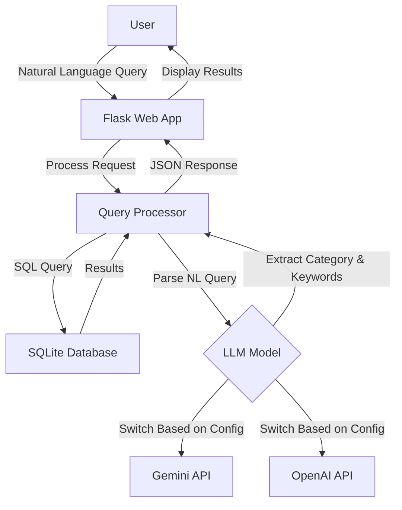

# BBC News Natural Language Query API

A lightweight natural language news query tool that combines a BBC news corpus with AI models (Google Gemini or OpenAI ChatGPT) to enable semantic search through news articles.

## Key Features

- 📰 Access BBC News article data using SQLite database
- 🔍 Efficient query caching mechanism to improve query speed
- 💬 Support for natural language query processing (using Gemini AI model)
- 🗄️ Concise, modular code structure
- 🚀 Lightweight design, easy to extend
- 🌐 Provides web interface for intuitive querying

## Dataset Information

This project uses the BBC News Dataset, which includes news articles in five main categories:
- **business**: Business news
- **entertainment**: Entertainment news
- **politics**: Political news
- **sport**: Sports news
- **tech**: Technology news

Data source: `https://huggingface.co/datasets/hf-internal/bbc-text/resolve/main/bbc-text.csv`

## 🔍 Quick Demo – Keyword‑Only Version (Baseline before LangChain)

The current implementation shows how far we can go **without** multi‑step
retrieval or an agent.  
It does exactly one thing:

1. **LLM extracts one keyword** from the user's natural‑language query  
2. **SQL `LIKE`** searches the BBC News corpus for that keyword  
3. Returns the first 10 matches, showing each article's *category* tag and
   the first few characters of its content

### How to run

```bash
# one‑time: convert CSV to SQLite  (skip if already done)
python scripts/csv_to_sqlite.py

# launch server
python app.py
```

Open http://localhost:5000, type a query, press Send.

#### Example queries

| Input | LLM‑extracted keyword  |
|-------|----------------------|
| Show me sports articles about football | football |
| tech news about Apple | apple |
| articles about foods | food (plural → singular) |
| latest news | (no keyword) → shows latest 10 articles |

When no article contains the keyword, you'll see:
⚠️ No news found.

## Project Structure

```
bbc-news-api/
├── app.py              # Flask application entry point
├── db.py               # Database connection and query handling
├── gemini_model.py     # Google Gemini API integration
├── chatgpt_model.py    # OpenAI ChatGPT integration
├── requirements.txt    # Project dependencies
├── .env                # Environment variables (API keys)
├── template.env        # Template for environment variables
├── README.md           # English documentation
├── README_ZH.md        # Chinese documentation
│
├── scripts/            
│   └── csv_to_sqlite.py  # Converts CSV dataset to SQLite
│
├── static/            
│   └── js/
│       └── main.js      # Frontend JavaScript
│
├── templates/         
│   └── index.html      # Main web interface
│
└── data/              
    ├── bbc-news.csv    # Original CSV dataset
    └── bbc_news.sqlite # SQLite database
```

## System Architecture



## Setup and Running

### Prerequisites
- Python 3.8+
- API key for Google Gemini or OpenAI (depending on which LLM you want to use)

### Installation

1. Clone the repository:
   ```bash
   git clone https://github.com/yourusername/bbc-news-api.git
   cd bbc-news-api
   ```

2. Create and activate a virtual environment:
   ```bash
   python -m venv venv
   source venv/bin/activate  # On Windows: venv\Scripts\activate
   ```

3. Install dependencies:
   ```bash
   pip install -r requirements.txt
   ```

4. Set up environment variables:
   ```bash
   cp template.env .env
   # Edit .env and add your API key(s)
   ```

5. Prepare the data:
   ```bash
   # Ensure bbc-news.csv is in the data/ folder
   python scripts/csv_to_sqlite.py
   ```

6. Run the application:
   ```bash
   python app.py
   ```

The application will be available at http://localhost:5000

## LLM Integration

The application can be configured to use either Google's Gemini or OpenAI's models by setting the `AI_MODEL_TYPE` environment variable in the `.env` file:

```
AI_MODEL_TYPE=GEMINI  # or OPENAI
GOOGLE_API_KEY=your_api_key_here
```

## RAG Testing Examples

The RAG (Retrieval-Augmented Generation) implementation significantly improves query capabilities compared to the baseline keyword search. Below are some example queries to demonstrate the improvements:

| Query | Expected Difference |
|-------|---------------------|
| Apple lawsuits | Baseline finds almost nothing; RAG can find and summarize passages about patent cases / court |
| Why did UK vote for Brexit | Baseline returns 0-1 results; RAG captures key passages about referendum, EU exit, June 2016 |
| phone maker recall scandal | Baseline has no results; RAG returns articles about battery recall / Samsung Galaxy |
| budget deficit reduction plan | RAG finds chancellor budget speech articles while Baseline has low hit rate |
| online privacy concerns | Observe how RAG summarizes content about data protection / children online safety |

When testing the application, toggle the "Use RAG" checkbox on/off while entering these queries to experience:

- **Improved hit rate**: RAG captures semantically relevant articles beyond keyword matching
- **Keyword highlighting**: Compare baseline keyword vs. RAG original query matches
- **Similarity scores**: Each selected passage includes a confidence score
- **Gemini summary**: Quick 3-sentence summary of the relevant information

## Technical Comparison: SQLite vs. RAG Vector Store

### Q1: How does the data storage format differ between SQLite and RAG?

| Architecture | Data Format | Query Method | Advantages | Disadvantages |
|--------------|-------------|--------------|------------|---------------|
| 🔍 SQLite (Baseline) | One row per news article (searched with text LIKE '%keyword%') | Keyword query | Fast, simple, low-cost | Cannot understand semantics |
| 🧠 FAISS Vector Store (RAG) | Articles split into chunks → Each chunk converted to vector and stored in FAISS | Semantic search (Similarity Search) | Understands semantics → Finds related passages | Initial setup more complex, requires LLM support |

#### Underlying Principles and Workflow Comparison:

**Baseline (Original Method):**
- Convert CSV → Store in SQLite
- Each article is a single record
- When querying, LLM only extracts keywords
- SQL query executed:
  ```sql
  SELECT * FROM news WHERE text LIKE '%apple%'
  ```
- Limited to exact matches, cannot find related content like "iPhone" or "digital rights"

**RAG (Enhanced Workflow):**
- Articles from CSV are split into 400-character chunks
  - Using RecursiveCharacterTextSplitter
- Each chunk is converted to a vector (using Gemini embedding)
- Vectors stored in FAISS vector database
- When querying, input query is also converted to vector → Uses similarity measure (cosine) to find top K most relevant text chunks
- LLM then summarizes an answer based on these relevant passages
- Process: Semantic alignment → Summarization

The `build_vectors.py` script is a preprocessing tool that:
- Splits text into chunks
- Records category + rowid
- Generates Gemini embedding vectors
- Saves everything to FAISS (.faiss + .pkl combination)

### Q2: Does the current feature/langchain-rag branch support both architectures?

Yes! The system is perfectly designed to demonstrate both architectures with a simple toggle.

**Architecture Switching:**

| Architecture | Current System | Details |
|--------------|----------------|---------|
| Left diagram: Current Architecture | ✅ Executed when "Use RAG" is unchecked | - Uses /query API<br>- LLM extracts keyword<br>- Queries SQLite<br>- Directly uses LIKE to find data |
| Right diagram: LangChain RAG | ✅ Executed when "Use RAG" is checked | - Uses /rag_query API<br>- LangChain performs vector retrieval<br>- Gemini summarizes from semantic passages |

The implementation enhances the RAG version with similarity scores, highlighting, and expandable passages, significantly improving query quality and perfectly achieving the right-side diagram's concept.

## Single-step vs. Multi-step Retrieval

The current implementation uses a **Single-step Retrieval RAG** approach, sometimes called "RAG-Lite," "Vanilla RAG," or "Basic RAG."

### Current Architecture: Single-step RAG

The workflow is straightforward:
1. User inputs a query (natural language)
2. The query is embedded (→ vector)
3. The vector database is searched for top-k similar passages (similarity_search_with_score)
4. These passages are combined and sent to LLM for summarization → generating an answer

### Comparison with Multi-step Retrieval

| Type | Single-step RAG (Current) | Multi-step RAG (LangChain Agent) |
|------|---------------------------|----------------------------------|
| Query Count | 1 vector query | Multiple (can interleave different data sources) |
| Conditional Logic | No condition evaluation, one-time process | LLM can make judgments based on returned content and re-query |
| Planning Capability | None | Can use Agent Planner to break down problems |
| Common Technologies | similarity_search() + prompt | AgentExecutor, RetrievalPlanner, Tool Calling, LangGraph |
| Example Scenario | Single QA, summaries, FAQ answers | Complex instructions like: "Find company financial reports, then look up CEO comments about them" |

### Current System Benefits

- ✅ Standard single-step RAG architecture
- ✅ Very effective for fixed-topic datasets (like news, FAQs, legal documents)
- ✅ Clean architecture that can be upgraded to multi-step by adding LangChain Agents or LangGraph

### Future Upgrade Paths to Multi-step Retrieval

Possible directions include:
- 🔁 Automatically detecting "insufficient data" and re-querying (as shown in your right-side diagram)
- 🔨 Using LangChain's PlanAndExecute agent
- 📚 Querying different data sources (e.g., querying vector database while also querying API responses)
- 🧠 Combining tool chains: Embedding + SQL + Web Search (compound retrieval)

For complex queries like "Research Apple lawsuit history, then compare with recent cases," a multi-step approach would be required.
