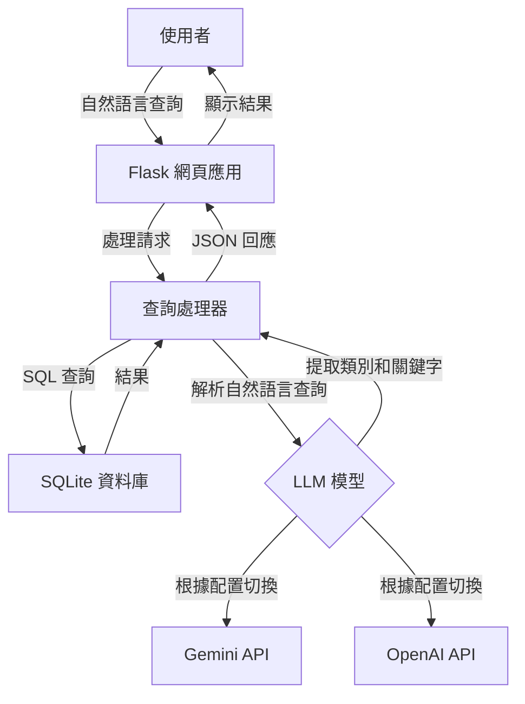

# BBC News 自然語言查詢 API

一個輕量級自然語言新聞查詢工具，結合 BBC 新聞語料庫與 AI 模型（Google Gemini 或 OpenAI ChatGPT）實現對新聞文章的語義化搜索。

## 主要特點

- 📰 使用 SQLite 資料庫存取 BBC News 文章數據
- 🔍 高效的查詢緩存機制，提升查詢速度
- 💬 支持自然語言查詢處理（使用Gemini AI模型）
- 🗄️ 簡潔、模塊化的代碼結構
- 🚀 輕量級設計，易於擴展
- 🌐 提供網頁界面進行直觀查詢

## 資料集資訊

本項目使用 BBC News Dataset，包含五個主要類別的新聞文章：
- **business**: 商業新聞
- **entertainment**: 娛樂新聞
- **politics**: 政治新聞
- **sport**: 體育新聞
- **tech**: 科技新聞

數據來源：`https://huggingface.co/datasets/hf-internal/bbc-text/resolve/main/bbc-text.csv`

## 🔍 快速演示 – 僅關鍵字版本（LangChain 之前的基準）

當前實現展示了在**不使用**多步驟檢索或代理的情況下，我們能達到的效果。  
它只做一件事：

1. **LLM 從用戶的自然語言查詢中提取一個關鍵字**  
2. 使用 **SQL `LIKE`** 在 BBC 新聞語料庫中搜索該關鍵字  
3. 返回前 10 個匹配項，顯示每篇文章的*類別*標籤和其內容的前幾個字符

### 如何運行

```bash
# 一次性：將 CSV 轉換為 SQLite（如已完成則跳過）
python scripts/csv_to_sqlite.py

# 啟動服務器
python app.py
```

打開 http://localhost:5000，輸入查詢，點擊發送。

#### 查詢範例

| 輸入 | LLM 提取的關鍵字 |
|-------|----------------------|
| 顯示關於足球的體育文章 | football |
| 關於蘋果的科技新聞 | apple |
| 關於食物的文章 | food (複數→單數) |
| 最新新聞 | (無關鍵字) → 顯示最新的 10 篇文章 |

當沒有文章包含關鍵字時，您會看到：
⚠️ 未找到新聞。

## 專案結構

```
bbc-news-api/
├── app.py              # Flask 應用程式入口點
├── db.py               # 資料庫連接與查詢處理
├── gemini_model.py     # Google Gemini API 整合
├── chatgpt_model.py    # OpenAI ChatGPT 整合
├── requirements.txt    # 專案依賴項
├── .env                # 環境變數（API 金鑰）
├── template.env        # 環境變數範本
├── README.md           # 英文文檔
├── README_ZH.md        # 中文文檔
│
├── scripts/            
│   └── csv_to_sqlite.py  # 將 CSV 資料集轉換為 SQLite
│
├── static/            
│   └── js/
│       └── main.js      # 前端 JavaScript
│
├── templates/         
│   └── index.html      # 主要網頁界面
│
└── data/              
    ├── bbc-news.csv    # 原始 CSV 資料集
    └── bbc_news.sqlite # SQLite 資料庫
```

## 系統架構



## 安裝與運行

### 前置需求
- Python 3.8+
- Google Gemini 或 OpenAI 的 API 金鑰（取決於您想使用的 LLM）

### 安裝流程

1. 克隆儲存庫：
   ```bash
   git clone https://github.com/yourusername/bbc-news-api.git
   cd bbc-news-api
   ```

2. 創建並啟動虛擬環境：
   ```bash
   python -m venv venv
   source venv/bin/activate  # 在 Windows 上：venv\Scripts\activate
   ```

3. 安裝依賴項：
   ```bash
   pip install -r requirements.txt
   ```

4. 設置環境變數：
   ```bash
   cp template.env .env
   # 編輯 .env 檔案並加入您的 API 金鑰
   ```

5. 準備資料：
   ```bash
   # 確保 bbc-news.csv 位於 data/ 資料夾中
   python scripts/csv_to_sqlite.py
   ```

6. 運行應用程式：
   ```bash
   python app.py
   ```

應用程式將在 http://localhost:5000 上可用

## LLM 整合

應用程式可以通過在 `.env` 文件中設置 `AI_MODEL_TYPE` 環境變數，配置使用 Google Gemini 或 OpenAI 的模型：

```
AI_MODEL_TYPE=GEMINI  # 或 OPENAI
GOOGLE_API_KEY=your_api_key_here
```

## RAG 測試範例

RAG（檢索增強生成）實現顯著提升了查詢能力，相比於基準關鍵字搜索。以下是一些展示改進效果的查詢示例：

| 查詢語句 | 預期差異 |
|-------|---------------------|
| Apple lawsuits | Baseline 幾乎找不到；RAG 能找到有關 patent cases / court 的段落並總結 |
| Why did UK vote for Brexit | Baseline 0~1 筆；RAG 能抓到 referendum, EU exit, June 2016 等關鍵段落 |
| phone maker recall scandal | Baseline 無結果；RAG 會返回 battery recall / Samsung Galaxy 相關文章 |
| budget deficit reduction plan | RAG 可找到 chancellor budget speech、Baseline 命中率低 |
| online privacy concerns | 可觀察 RAG 摘要如何歸納 data protection / children online safety |

測試應用程式時，勾選/不勾選「Use RAG」選項，同時輸入以上查詢，體驗：

- **命中率提升**：RAG 能抓到語意相關文章，超越關鍵字比對
- **關鍵字高亮**：比較 baseline keyword 或 RAG 原始 query 的匹配
- **相似度 score**：每段被選中的內容都有信心程度評分
- **Gemini summary**：3 句話快速總結相關信息

## 技術比較：SQLite vs. RAG 向量儲存

### Q1：導入 RAG 後，資料儲存格式跟 SQLite 有什麼差別？

| 架構 | 使用資料形式 | 查詢方式 | 優點 | 缺點 |
|--------------|-------------|--------------|------------|---------------|
| 🔍 SQLite（Baseline）| 一筆新聞一筆 row（用 text LIKE '%keyword%' 搜）| 關鍵字查詢 | 快、簡單、低成本 | 無法理解語意 |
| 🧠 FAISS 向量庫（RAG）| 文章先分段 → 每段變成向量並儲存於 FAISS | 語意搜尋（Similarity Search）| 能理解語意 → 找出關聯段落 | 初始建立較麻煩、需 GPU 支援 LLM |

#### 原理與流程比較：

**Baseline（原來的方式）：**
- 把 CSV ➜ 存成 SQLite
- 每篇文章是一筆記錄
- 查詢時 LLM 只是負責擷取關鍵字
- 最後 SQL 查詢：
  ```sql
  SELECT * FROM news WHERE text LIKE '%apple%'
  ```
- 限於 exact match，無法找到例如 "iPhone", "digital rights" 這種相關內容

**RAG（導入後流程）：**
- 把 CSV 每篇文章 → 拆成 400 字的段落
  - 用 RecursiveCharacterTextSplitter
- 每段變成一個向量（用 Gemini embedding）
- 存到 FAISS 向量庫
- 查詢時輸入 query 也會被轉成向量 → 用相似度（cosine）找出前 K 段最相關文本
- 這時 LLM 再根據這幾段段落總結出答案
- 過程：語意對齊 → 再總結

`build_vectors.py` 是一個「先做向量分段＋嵌入」的 script，幫你準備：
- 段落（分割後的 text）
- category + rowid
- Gemini embedding vector
- 再存到 FAISS 的 .faiss + .pkl 組合中

### Q2：目前這個 feature/langchain-rag 分支是否同時支援兩種架構？

是的！系統完美設計，通過簡單的切換即可展示兩種架構。

**模式切換對應：**

| 架構 | 現在的系統 | 說明 |
|--------------|----------------|---------|
| 左圖：Current Architecture | ✅ 不打勾 Use RAG 時執行 | - 使用 /query API<br>- LLM 提取 keyword<br>- 查 SQLite<br>- 直接用 LIKE 找資料 |
| 右圖：LangChain RAG | ✅ 打勾 Use RAG 時執行 | - 使用 /rag_query API<br>- LangChain 執行向量檢索<br>- Gemini 摘要來自語意段落 |

實現中還加入了分數、highlight、段落展開等功能，讓 RAG 版本的查詢品質顯著提升，完全達成右側架構的精神。

## 單步檢索 vs. 多步檢索

目前的實現使用了**單步檢索（Single-step Retrieval）RAG**方法，有時也被稱為「RAG-Lite」、「Vanilla RAG」或「Basic RAG」。

### 目前架構：單步檢索 RAG

工作流程非常直接：
1. 使用者輸入 query（自然語言）
2. 將 query 做一次 embedding（→ 向量）
3. 到向量資料庫中搜尋 top-k 相似段落（similarity_search_with_score）
4. 把這些段落串起來，丟給 LLM 總結 → 產出答案

### 與多步檢索的比較

| 類型 | 單步檢索 RAG（目前） | 多步檢索 RAG（LangChain Agent） |
|------|----------------------|--------------------------------|
| 查詢次數 | 1 次向量查詢 | 多次（甚至交錯不同資料源） |
| 條件邏輯 | 無條件判斷，一次性完成 | LLM 根據回傳內容再做判斷、重查 |
| 計劃能力 | 不具備 | 可用 Agent Planner 拆解問題 |
| 常見技術 | similarity_search() + prompt | AgentExecutor, RetrievalPlanner, Tool Calling, LangGraph |
| 範例情境 | 單一 QA、摘要、FAQ 回答 | 複雜指令，如：「先找公司財報，再查 CEO 對此評論」 |

### 目前系統優勢

- ✅ 是標準的單步 RAG 架構
- ✅ 效果已經非常不錯，適合用於固定主題資料集（如新聞、FAQ、法條等）
- ✅ 架構清晰，日後要升級成多步只需要加 LangChain Agents 或 LangGraph

### 未來升級至多步檢索的路徑

可能的方向包括：
- 🔁 自動判斷「資料不足」時自動回查（如您的圖右側所示）
- 🔨 使用 LangChain 的 PlanAndExecute agent
- 📚 查詢不同資料來源（例如一邊查向量資料庫，一邊查 API 回應）
- 🧠 結合工具鏈：Embedding + SQL + Web Search（複合 Retrieval）

對於像「幫我查 Apple 官司歷史、再幫我比對最近是否有新案件」這樣的複雜查詢，將需要多步方法。