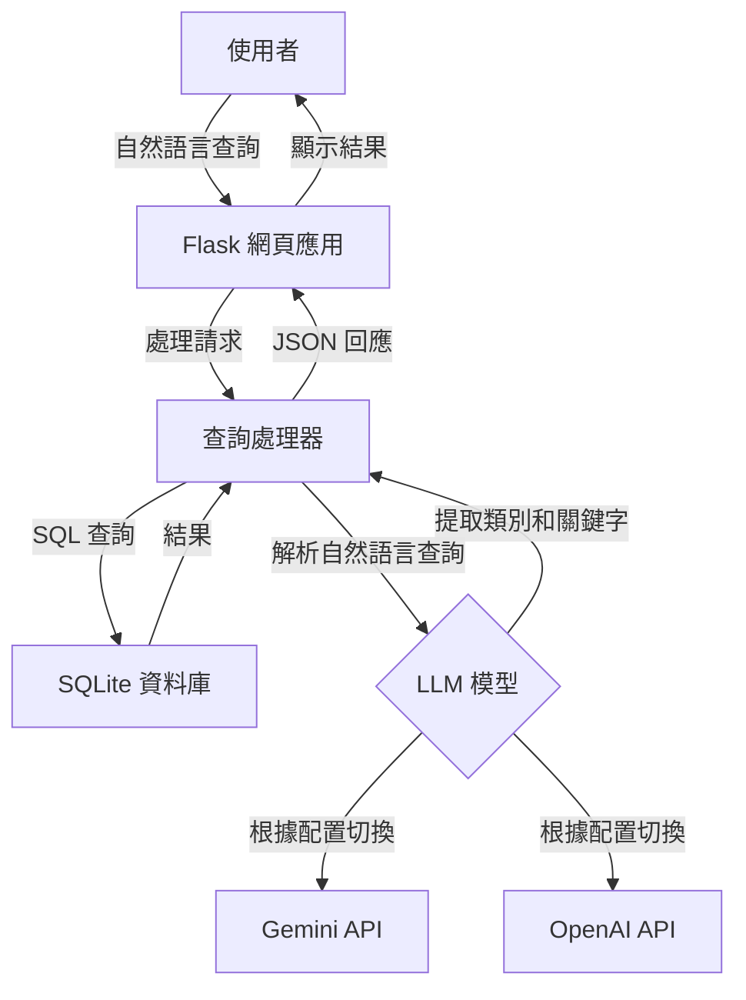

# BBC News 自然語言查詢 API

一個輕量級自然語言新聞查詢工具，結合 BBC 新聞語料庫與 AI 模型（Google Gemini 或 OpenAI ChatGPT）實現對新聞文章的語義化搜索。

## 主要特點

- 📰 使用 SQLite 資料庫存取 BBC News 文章數據
- 🔍 高效的查詢緩存機制，提升查詢速度
- 💬 支持自然語言查詢處理（使用Gemini AI模型）
- 🗄️ 簡潔、模塊化的代碼結構
- 🚀 輕量級設計，易於擴展
- 🌐 提供網頁界面進行直觀查詢

## 資料集資訊

本項目使用 BBC News Dataset，包含五個主要類別的新聞文章：
- **business**: 商業新聞
- **entertainment**: 娛樂新聞
- **politics**: 政治新聞
- **sport**: 體育新聞
- **tech**: 科技新聞

數據來源：`https://huggingface.co/datasets/hf-internal/bbc-text/resolve/main/bbc-text.csv`

## 🔍 快速演示 – 僅關鍵字版本（LangChain 之前的基準）

當前實現展示了在**不使用**多步驟檢索或代理的情況下，我們能達到的效果。  
它只做一件事：

1. **LLM 從用戶的自然語言查詢中提取一個關鍵字**  
2. 使用 **SQL `LIKE`** 在 BBC 新聞語料庫中搜索該關鍵字  
3. 返回前 10 個匹配項，顯示每篇文章的*類別*標籤和其內容的前幾個字符

### 如何運行

```bash
# 一次性：將 CSV 轉換為 SQLite（如已完成則跳過）
python scripts/csv_to_sqlite.py

# 啟動服務器
python app.py
```

打開 http://localhost:5000，輸入查詢，點擊發送。

#### 查詢範例

| 輸入 | LLM 提取的關鍵字 |
|-------|----------------------|
| 顯示關於足球的體育文章 | football |
| 關於蘋果的科技新聞 | apple |
| 關於食物的文章 | food (複數→單數) |
| 最新新聞 | (無關鍵字) → 顯示最新的 10 篇文章 |

當沒有文章包含關鍵字時，您會看到：
⚠️ 未找到新聞。

## 專案結構

```
bbc-news-api/
├── app.py              # Flask 應用程式入口點
├── db.py               # 資料庫連接與查詢處理
├── gemini_model.py     # Google Gemini API 整合
├── chatgpt_model.py    # OpenAI ChatGPT 整合
├── requirements.txt    # 專案依賴項
├── .env                # 環境變數（API 金鑰）
├── template.env        # 環境變數範本
├── README.md           # 英文文檔
├── README_ZH.md        # 中文文檔
│
├── scripts/            
│   └── csv_to_sqlite.py  # 將 CSV 資料集轉換為 SQLite
│
├── static/            
│   └── js/
│       └── main.js      # 前端 JavaScript
│
├── templates/         
│   └── index.html      # 主要網頁界面
│
└── data/              
    ├── bbc-news.csv    # 原始 CSV 資料集
    └── bbc_news.sqlite # SQLite 資料庫
```

## 系統架構



## 安裝與運行

### 前置需求
- Python 3.8+
- Google Gemini 或 OpenAI 的 API 金鑰（取決於您想使用的 LLM）

### 安裝流程

1. 克隆儲存庫：
   ```bash
   git clone https://github.com/yourusername/bbc-news-api.git
   cd bbc-news-api
   ```

2. 創建並啟動虛擬環境：
   ```bash
   python -m venv venv
   source venv/bin/activate  # 在 Windows 上：venv\Scripts\activate
   ```

3. 安裝依賴項：
   ```bash
   pip install -r requirements.txt
   ```

4. 設置環境變數：
   ```bash
   cp template.env .env
   # 編輯 .env 檔案並加入您的 API 金鑰
   ```

5. 準備資料：
   ```bash
   # 確保 bbc-news.csv 位於 data/ 資料夾中
   python scripts/csv_to_sqlite.py
   ```

6. 運行應用程式：
   ```bash
   python app.py
   ```

應用程式將在 http://localhost:5000 上可用

## API 端點

### `/query` (POST)
使用配置的 LLM 處理自然語言查詢。

**請求：**
```json
{
  "query": "顯示關於蘋果的科技新聞"
}
```

**回應：**
```json
{
  "query": "顯示關於蘋果的科技新聞",
  "parsed": {
    "category": "tech",
    "keyword": "Apple"
  },
  "results": [
    {
      "category": "tech",
      "text": "...[文章內容]..."
    },
    ...
  ]
}
```

### `/news` (GET)
獲取新聞文章，可選擇性過濾。

**參數：**
- `category`：按新聞類別過濾（business, entertainment, politics, sport, tech）
- `keyword`：按文本中的關鍵字過濾
- `page`：頁碼（預設：1）
- `limit`：每頁結果數（預設：20）

**回應：**
```json
{
  "page": 1,
  "limit": 20,
  "total_pages": 10,
  "total": 200,
  "data": [
    {
      "category": "tech",
      "text": "...[文章內容]..."
    },
    ...
  ]
}
```

### `/search` (GET)
在新聞資料庫中進行簡單的關鍵字搜索。

**參數：**
- `q`：搜索查詢
- `page`：頁碼（預設：1）
- `limit`：每頁結果數（預設：20）

**回應：**
與 `/news` 端點格式相同

### `/system_status` (GET)
檢查系統狀態和資料庫可用性。

**回應：**
```json
{
  "db_exists": true,
  "time": 1618123456.789
}
```

## LLM 整合

應用程式可以通過在 `.env` 文件中設置 `AI_MODEL_TYPE` 環境變數，配置使用 Google Gemini 或 OpenAI 的模型：

```
AI_MODEL_TYPE=GEMINI  # 或 OPENAI
GEMINI_API_KEY=your_api_key_here
```

## 查詢範例

- "尋找關於手機的科技新聞"
- "顯示關於足球的體育文章"
- "有哪些提到電影的娛樂新聞？"
- "尋找 2021 年的商業新聞"
- "顯示關於選舉的政治新聞"

- 
```
import React, { useEffect, useRef, useState, useContext } from 'react';
import io from 'socket.io-client';
import { v4 as uuidv4 } from 'uuid';
import * as RestApi from '@/RestApi';
import WidgetContext from '@/context/widgetContext';
import './GptComponent.css';

/**
 * 這是新版 GPTComponent：
 * ‑ 保留原先純前端的新樣式
 * ‑ 嵌入精簡版 WebSocket 連線（源自舊 ChatComponent）
 * ‑ 目前僅處理基本訊息收發 & debug mode，可逐步擴充其它事件
 */
const GptComponent = () => {
  /** ---------- 狀態 ---------- */
  const [message, setMessage] = useState('');
  const [chatMessages, setChatMessages] = useState([]); // { text, isUser }
  const [isAnalysing, setIsAnalysing] = useState(false);
  const [allowUserInput, setAllowUserInput] = useState(true);
  const [debugMode, setDebugMode] = useState(true);

  /** ---------- WebSocket ---------- */
  const socketRef = useRef(null);
  const sessionId = useRef(null);

  // 從 WidgetContext 取 initialPayload（可選，沒有就 undefined）
  const { dataQueryPayload: initialPayload } = useContext(WidgetContext) || {};

  /** 建立與 LLM 的 socket 連線 */
  useEffect(() => {
    const socket = io();

    // 1⃣️ 先做 auth
    RestApi.getADFsToken().then(token => {
      socket.emit('authenticate-llm', { auth: token });
    });

    // 2⃣️ 認證失敗
    socket.on('authentication-error', recv => {
      setChatMessages(recv.data.map(t => ({ text: t, isUser: false })));
      socket.close();
    });

    // 3⃣️ 認證成功 & welcome message
    socket.on('welcome message', recv => {
      sessionId.current = recv['session_id'];
      setChatMessages(prev => [
        ...prev,
        ...recv.data.map(t => ({ text: t, isUser: false }))
      ]);
      // 若有 initialPayload，交給後端分析
      if (initialPayload) {
        socket.emit('analyze_payload', { text: JSON.stringify(initialPayload), session_id: sessionId.current });
      }
    });

    // 4⃣️ 一般日誌輸出
    socket.on('log', data => {
      setChatMessages(prev => [
        ...prev,
        ...data.data.map(t => ({ text: t, isUser: false }))
      ]);
    });

    // 5⃣️ 允許再次輸入
    socket.on('allow_user_input', () => setAllowUserInput(true));

    socketRef.current = socket;

    // 定期刷新 token（4 分鐘）
    const tokenTimer = setInterval(() => {
      RestApi.getADFsToken().then(token => {
        socket.emit('update-token', { token, session_id: sessionId.current });
      });
    }, 240000);

    return () => {
      clearInterval(tokenTimer);
      socket.close();
    };
  }, [initialPayload]);

  /** 發送文字訊息至後端 */
  const sendMessage = (text) => {
    if (!socketRef.current) return;
    socketRef.current.emit('message', {
      query: text,
      debug_mode: debugMode,
      session_id: sessionId.current
    });
  };

  /** ---------- UI 事件 ---------- */
  const handleSubmit = (e) => {
    e.preventDefault();
    if (!message.trim()) return;

    // 立刻把使用者訊息 push 到畫面
    setChatMessages(prev => [...prev, { text: message, isUser: true }]);
    setIsAnalysing(true);
    setAllowUserInput(false);
    const userText = message;
    setMessage('');

    // 發送到後端
    sendMessage(userText);
  };

  const handleKeyDown = (e) => {
    if (e.key === 'Enter' && !e.shiftKey) {
      e.preventDefault();
      handleSubmit(e);
    }
  };

  const handleStopGeneration = () => {
    socketRef.current?.emit('stop_generation');
    setAllowUserInput(true);
    setIsAnalysing(false);
  };

  /** 從後端接收新訊息時，isAnalysing 結束 */
  useEffect(() => {
    if (!socketRef.current) return;
    const socket = socketRef.current;
    const onApiResult = (data) => {
      setChatMessages(prev => [...prev, { text: data.data ?? data.text ?? '[no‑msg]', isUser: false }]);
      setIsAnalysing(false);
    };
    socket.on('result', onApiResult);
    socket.on('error', onApiResult);

    return () => {
      socket.off('result', onApiResult);
      socket.off('error', onApiResult);
    };
  }, []);

  /** ---------- Render ---------- */
  return (
    <div className="gpt-component">
      <div className="gpt-header">
        <div className="gpt-title">GPT Component</div>
        <div className="gpt-actions">
          <button className="action-button close-button" onClick={handleStopGeneration}>✕</button>
        </div>
      </div>

      <div className="gpt-tabs">
        <div className="gpt-tab gpt-tab-active">Chat</div>
        <div className="gpt-tab" onClick={() => setDebugMode(!debugMode)}>
          Debug&nbsp;{debugMode ? 'ON' : 'OFF'}
        </div>
      </div>

      <div className="gpt-content">
        <div className="gpt-chat-area">
          {chatMessages.length === 0 && !isAnalysing && (
            <div className="gpt-empty-state">
              <div className="gpt-stars">✨</div>
              <div className="gpt-greeting">
                <h2>Hi User, I'm <span className="gpt-highlight">GPT Component</span>.</h2>
                <p>Ask me anything</p>
              </div>
            </div>
          )}

          {chatMessages.map((msg, idx) => (
            <div key={idx} className={`gpt-message ${msg.isUser ? 'gpt-user-message' : 'gpt-ai-message'}`}>
              {msg.text}
            </div>
          ))}

          {isAnalysing && (
            <div className="analysing">
              <div className="analysing-icon"><span style={{ color: '#fff' }}>✨</span></div>
              <div className="analysing-text">Analysing...</div>
            </div>
          )}
        </div>
      </div>

      <div className="gpt-input-area">
        <form onSubmit={handleSubmit}>
          <div className="gpt-input-container">
            <textarea
              className="gpt-input"
              placeholder="Ask a question"
              value={message}
              onChange={(e) => setMessage(e.target.value)}
              onKeyDown={handleKeyDown}
              rows={4}
              style={{ color: '#ffffff' }}
              disabled={!allowUserInput}
            />
            <div className="gpt-input-buttons">
              <button type="submit" className="gpt-send-btn" disabled={!allowUserInput}>
                <svg width="16" height="16" viewBox="0 0 24 24" fill="none" xmlns="http://www.w3.org/2000/svg">
                  <path d="M22 2L11 13" stroke="#A0A0A0" strokeWidth="2" strokeLinecap="round" strokeLinejoin="round" />
                  <path d="M22 2L15 22L11 13L2 9L22 2Z" stroke="#A0A0A0" strokeWidth="2" strokeLinecap="round" strokeLinejoin="round" />
                </svg>
              </button>
            </div>
          </div>
        </form>
        <div className="gpt-disclaimer">*LLMs and GPTs can make mistakes. Verify all claims.</div>
      </div>
    </div>
  );
};

export default GptComponent;

```
