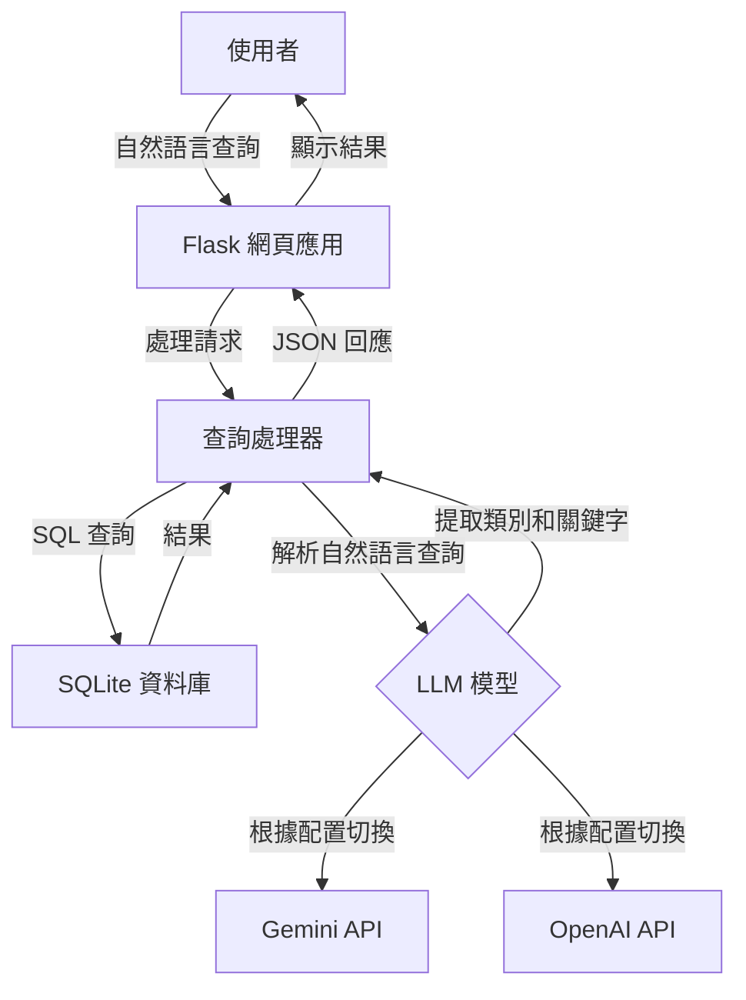

# BBC News 自然語言查詢 API

一個輕量級自然語言新聞查詢工具，結合 BBC 新聞語料庫與 AI 模型（Google Gemini 或 OpenAI ChatGPT）實現對新聞文章的語義化搜索。

## 主要特點

- 📰 使用 SQLite 資料庫存取 BBC News 文章數據
- 🔍 高效的查詢緩存機制，提升查詢速度
- 💬 支持自然語言查詢處理（使用Gemini AI模型）
- 🗄️ 簡潔、模塊化的代碼結構
- 🚀 輕量級設計，易於擴展
- 🌐 提供網頁界面進行直觀查詢

## 資料集資訊

本項目使用 BBC News Dataset，包含五個主要類別的新聞文章：
- **business**: 商業新聞
- **entertainment**: 娛樂新聞
- **politics**: 政治新聞
- **sport**: 體育新聞
- **tech**: 科技新聞

數據來源：`https://huggingface.co/datasets/hf-internal/bbc-text/resolve/main/bbc-text.csv`

## 🔍 快速演示 – 僅關鍵字版本（LangChain 之前的基準）

當前實現展示了在**不使用**多步驟檢索或代理的情況下，我們能達到的效果。  
它只做一件事：

1. **LLM 從用戶的自然語言查詢中提取一個關鍵字**  
2. 使用 **SQL `LIKE`** 在 BBC 新聞語料庫中搜索該關鍵字  
3. 返回前 10 個匹配項，顯示每篇文章的*類別*標籤和其內容的前幾個字符

### 如何運行

```bash
# 一次性：將 CSV 轉換為 SQLite（如已完成則跳過）
python scripts/csv_to_sqlite.py

# 啟動服務器
python app.py
```

打開 http://localhost:5000，輸入查詢，點擊發送。

#### 查詢範例

| 輸入 | LLM 提取的關鍵字 |
|-------|----------------------|
| 顯示關於足球的體育文章 | football |
| 關於蘋果的科技新聞 | apple |
| 關於食物的文章 | food (複數→單數) |
| 最新新聞 | (無關鍵字) → 顯示最新的 10 篇文章 |

當沒有文章包含關鍵字時，您會看到：
⚠️ 未找到新聞。

## 專案結構

```
bbc-news-api/
├── app.py              # Flask 應用程式入口點
├── db.py               # 資料庫連接與查詢處理
├── gemini_model.py     # Google Gemini API 整合
├── chatgpt_model.py    # OpenAI ChatGPT 整合
├── requirements.txt    # 專案依賴項
├── .env                # 環境變數（API 金鑰）
├── template.env        # 環境變數範本
├── README.md           # 英文文檔
├── README_ZH.md        # 中文文檔
│
├── scripts/            
│   └── csv_to_sqlite.py  # 將 CSV 資料集轉換為 SQLite
│
├── static/            
│   └── js/
│       └── main.js      # 前端 JavaScript
│
├── templates/         
│   └── index.html      # 主要網頁界面
│
└── data/              
    ├── bbc-news.csv    # 原始 CSV 資料集
    └── bbc_news.sqlite # SQLite 資料庫
```

## 系統架構



## 安裝與運行

### 前置需求
- Python 3.8+
- Google Gemini 或 OpenAI 的 API 金鑰（取決於您想使用的 LLM）

### 安裝流程

1. 克隆儲存庫：
   ```bash
   git clone https://github.com/yourusername/bbc-news-api.git
   cd bbc-news-api
   ```

2. 創建並啟動虛擬環境：
   ```bash
   python -m venv venv
   source venv/bin/activate  # 在 Windows 上：venv\Scripts\activate
   ```

3. 安裝依賴項：
   ```bash
   pip install -r requirements.txt
   ```

4. 設置環境變數：
   ```bash
   cp template.env .env
   # 編輯 .env 檔案並加入您的 API 金鑰
   ```

5. 準備資料：
   ```bash
   # 確保 bbc-news.csv 位於 data/ 資料夾中
   python scripts/csv_to_sqlite.py
   ```

6. 運行應用程式：
   ```bash
   python app.py
   ```

應用程式將在 http://localhost:5000 上可用

## LLM 整合

應用程式可以通過在 `.env` 文件中設置 `AI_MODEL_TYPE` 環境變數，配置使用 Google Gemini 或 OpenAI 的模型：

```
AI_MODEL_TYPE=GEMINI  # 或 OPENAI
GOOGLE_API_KEY=your_api_key_here
```

## RAG 測試範例

RAG（檢索增強生成）實現顯著提升了查詢能力，相比於基準關鍵字搜索。以下是一些展示改進效果的查詢示例：

| 查詢語句 | 預期差異 |
|-------|---------------------|
| Apple lawsuits | Baseline 幾乎找不到；RAG 能找到有關 patent cases / court 的段落並總結 |
| Why did UK vote for Brexit | Baseline 0~1 筆；RAG 能抓到 referendum, EU exit, June 2016 等關鍵段落 |
| phone maker recall scandal | Baseline 無結果；RAG 會返回 battery recall / Samsung Galaxy 相關文章 |
| budget deficit reduction plan | RAG 可找到 chancellor budget speech、Baseline 命中率低 |
| online privacy concerns | 可觀察 RAG 摘要如何歸納 data protection / children online safety |

測試應用程式時，勾選/不勾選「Use RAG」選項，同時輸入以上查詢，體驗：

- **命中率提升**：RAG 能抓到語意相關文章，超越關鍵字比對
- **關鍵字高亮**：比較 baseline keyword 或 RAG 原始 query 的匹配
- **相似度 score**：每段被選中的內容都有信心程度評分
- **Gemini summary**：3 句話快速總結相關信息